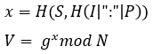
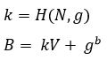
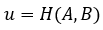
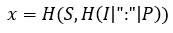
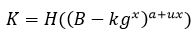
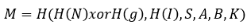
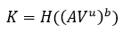
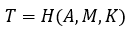
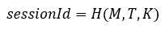

## Онлайн-сервис защищенного хранения данных с использованием протокола аутентификации SRP 6a 
Онлайн-сервис разделен на две части:
* [backend (Java)](https://github.com/GlebDurygin/online-password-storage-backend)
* [frontend (JavaScript)](https://github.com/GlebDurygin/online-password-storage-frontend)

В рамках данного онлайн-сервиса были реализованы следующие фунции:
* [аутентификация с использованием протокола SRP 6A](#SRP-6A)
* [механизм сессий и таймауты](#sessions)
* [шифрование AES-256](#encryption)

#### <a name="SRP-6A"></a> Реализация SRP 6A
Спецификация протокола [Secure Remote Protocol 6a](http://srp.stanford.edu/design.html). Целью протокола SRP-6A является выработка приватного ключа сессии (`sessionKey`), который в дальнейшем при работе с данными будет использоваться как ключ шифрования.
##### Обозначения
-	N – большое простое число (N = 2q +1, где q также простое);
-	g – генератор группы по простому модулю N;
-	k – параметр множителя;
-	S – соль (криптографический случайный параметр хеширования);
-	V – верификатор;
-	I – уникальный идентификатор (имя пользователя);
-	P – пароль в открытом виде;
-	a,b – секретные случайные значения;
-	A, B – эмферные ключи;
-	u – маскировочное значение протокола;
-	x – приватный ключ, вспомогательный параметр;
-	K – ключ сессии;
-	M,T – проверочные значения.

##### Этап 1. Регистрация пользователя
1) Клиент вводит имя пользователя I и пароль P во вкладке [SignUp](https://github.com/GlebDurygin/online-password-storage-frontend/blob/master/src/components/signup/SignUp.jsx)

2) Вычисляется соль S c помощью функции `this.srpService.computeSalt()`. Соль вычисляется в сервисе [SrpService](https://github.com/GlebDurygin/online-password-storage-frontend/blob/master/src/components/crypto/SrpService.jsx). Генерируется случайная строка длинной 16 байт.
    ```
    function computeSalt() {
        return generateRandom(16);
    }
    ```
    Пример - `salt = 70b4e0fd73ceff7dbd5a0856eae2453d`
3) Вычисляются приватный ключ x и верификатор V `this.srpService.computeVerifier(salt, this.state.usernameValue, this.state.passwordValue)`:

    
    
    Данное вычисление также происходит в сервисе [SrpService](https://github.com/GlebDurygin/online-password-storage-frontend/blob/master/src/components/crypto/SrpService.jsx). На вход подаются: соль S, имя пользователя I, пароль P: 
    
    ```
   function computeVerifier(salt, username, password) {
        let privateKey = computePrivateKey(salt, username, password);
        let x = bigInt(privateKey, 16);
        return params.g.modPow(x, params.N).toString(16);
   }
   
   function computePrivateKey(salt, username, password) {
       let usernameWithPassword = username + " : " + password;
       let usernameWithPasswordHash = hash(usernameWithPassword);
       return hash(salt, usernameWithPasswordHash);
   }
   ```
   Пример:
   ```
   salt = 70b4e0fd73ceff7dbd5a0856eae2453d
   I = username
   P = password
   privateKey (x) = 50b890229999907e937c0fbef7569776a201637e199b1d6a552e02864b8acce1
   verifier = 2b87e42137cc0cc6340a7ba6210a0df95b41f8baa4100572d85a03aae07c678503697f2d79a61d5f75e5ed1d5f15d9d6be9b9054fd8ba67d978c423923041614a5074d2109a27156bbd2d014af0c54fbfe23d8c6b3d29ce8a6784f71bde51ef5157335aad2f1532f685f65455509fcaf3eb49f315c99b409f73d28508baea95290cfe47a955d553546bb31170215df18c215475ce74a43c2c2398f6066d24fbe19a74d4d7ab5a914f8a10fcbb346283f2626b3bd9601c9a32a7f0892d058d3f5927ab301189edaa109bab62d4cc78271227b17175aee6f5a7cc0c6ea5297cb363f5296658229da8b7a97e7a32318c15173eba1d769ba4cd37a390166032e9b83
   ```
4) Данные (I, S, V) шифруются с помощью публичного ключа по умолчанию в сервисе [Cipher](https://github.com/GlebDurygin/online-password-storage-frontend/blob/master/src/components/crypto/rc4.js) и отправляются в виде POST запроса по адресу `http://localhost:9080/sign-up` на сервер с помощью функции [sendRequestToServer](https://github.com/GlebDurygin/online-password-storage-frontend/blob/master/src/components/signup/SignUp.jsx):
   ```
   sendRequestToServer = () => {
       let salt = this.srpService.computeSalt();
       let verifier = this.srpService.computeVerifier(salt, this.state.usernameValue, this.state.passwordValue);
       fetch('http://localhost:9080/sign-up', {
           method: 'POST',
           headers: {
               'Accept': 'application/json',
               'Content-Type': 'application/json'
           },
           body: JSON.stringify({
               username: this.cipher(true, this.params.anonymousKey, this.state.usernameValue),
               salt: this.cipher(true, this.params.anonymousKey, salt),
               verifier: this.cipher(true, this.params.anonymousKey, verifier)
           }),
       })
           .then(response => {
               if (response.ok) {
                   this.props.history.push("/sign-in");
               } else {
                   this.toggleNotification("dangerNotification");
               }
           })
           .catch(error => {
               this.toggleNotification("dangerNotification");
           })
   };
   ```
5) Сервер получает данные в классе [UserController](src/main/java/com/university/diploma/controller/UserController.java) в функции `signUpSubmit()`. Сначала данные дешифруются с использованием приватного ключа по умолчанию в классе [CipherService](src/main/java/com/university/diploma/service/CipherService.java).
Затем данные, переданные с клиента, передаеются в [UserDataService](src/main/java/com/university/diploma/service/UserDataService.java) в функцию `create()`, которая возвращает `false`, если пользователь с таким именем пользователя уже существует в БД.
Если пользователь существует, то отправляется ответ со статусом `BAD_REQUEST`, если пользователь зарегистрирован, то статус `OK` и данные (I, V, S) сохраняются в БД.
   ```
   @CrossOrigin(origins = "http://localhost:3000")
   @PostMapping(value = "/sign-up")
   public ResponseEntity<?> signUpSubmit(@RequestBody SignUpForm form) {
       UserSignUpDto userSignUpDto = cipherService.decryptSignUpForm(form, ANONYMOUS_SESSION_KEY.getBytes());
       if (userDataService.create(userSignUpDto)) {
           return new ResponseEntity<>(HttpStatus.OK);
       } else {
           return new ResponseEntity<>(HttpStatus.BAD_REQUEST);
       }
   }
   ```

##### Этап 2. Аутентификация пользователя
1) Клиент вводит имя пользователя I и пароль P во вкладке [SignIn](https://github.com/GlebDurygin/online-password-storage-frontend/blob/master/src/components/signin/SignIn.jsx)

2) На клиенте вычисляется эмферный ключ A `this.srpService.computeEmphaticKeyA()` в сервисе [SrpService](https://github.com/GlebDurygin/online-password-storage-frontend/blob/master/src/components/crypto/SrpService.jsx):
    ```
   function computeEmphaticKeyA() {
       let random = generateRandom(32);
       let a = bigInt(random, 16);
   
       return {
           emphaticKeyA: params.g.modPow(a, params.N).toString(16),
           randomA: a
       };
   }
   
   function generateRandom(bytes) {
       return randomHex(bytes)
   }
    ```
   Пример:
   ```
   randomA = 337bc1cc7ca0a55b0148052e7af951084fa99a6445609525582a7cc407b83c9b
   emphaticKeyA = 26d5825feaedb9f08cf8ceb165412cdecb0c2df12013469bf975f5bc992b5914c719eda138fce2a34d5ab42824855b10d82e957c364b1201b30c2dde17f87f259dc461035ee98b62ab4b5d81639e54c8e6e88cdb21d386da986cf4eb527d17c990ad757f679aeda9a5f48b7c91b8366a7805d4e890be2b049bf01fedfeee93946c43c49069cfde34ea8d599812ddb9040283ed457f97fbb6d56ae9034ebacb488110b87cd2c16edd64826679283dc28f70959cd6f7e566360a4dc1c0d97b17ce91632f3f9ced391c9ba2b315edc5f24a0316f2ed770d114e0610506b36bb5fbca85fa9bcdd72974362431bd37466062db7e034b0a38094c4de98e564afc86487
   ```
3) Эмферный ключ А и имя пользователя I в зашифрованном с помощью публичного ключа виде отправляются с помощью POST по адресу `http://localhost:9080//sign-in-authentication` на сервер:
   ```
   fetch('http://localhost:9080//sign-in-authentication', {
       method: 'POST',
       headers: {
           'Accept': 'application/json',
           'Content-Type': 'application/json'
       },
       body: JSON.stringify({
           username: this.cipher(true, this.params.anonymousKey, this.state.usernameValue),
           emphaticKeyA: this.cipher(true, this.params.anonymousKey, emphaticKeyAValues.emphaticKeyA)
       })
   })
   ```
4) Сервер принимает значения и выполняет следующие действия:
   * Расшифровывает тело запроса `Map<String, String> body = cipherService.decryptBody(encryptedBody, ANONYMOUS_SESSION_KEY.getBytes());`
   * По имени пользователя I ищет пользователя `User user = userDataService.findUserByUsername(body.get("username"));` 
   Если пользователь не найден, то клиенту отправляется запрос со статусом `BAD_REQUEST`.
   * Для пользователя создается сессия `AppSession appSession = appSessionBean.createAppSession(user);` и вырабатывается ключ аутентификации `authenticationKey`.
   Ключ аутентифкации нужен, чтобы продолжить процесс аутентификации на следующем этап при запросе по адресу `http://localhost:9080//sign-in-check`.
        Пример:
        ```
        authentificationKey = 1cb1ef8cb628017f8e50f17dc24b09495f44a88022590600f5ca466db9515fd2
        ```
   * Из БД по имени пользователя I получают соль S
   * Вычисляется значение эмферного ключа B в сервисе [SrpService](src/main/java/com/university/diploma/service/SRPService.java)
   
        
        ```
        public void computeEmphaticKeyB(AuthenticationDetails details) {
            byte[] randomB = new byte[32];
            randomGeneratorService.nextBytes(randomB);
            details.setRandomB(new BigInteger(randomB).toString(16));
        
            BigInteger V = new BigInteger(details.getVerifier(), 16);
            BigInteger emphaticKeyB = K.multiply(V)
                    .add(G.modPow(new BigInteger(details.getRandomB().getBytes()), N))
                    .mod(N);
            details.setEmphaticKeyB(emphaticKeyB.toString(16));
        }
        ```
        Пример:
        ```
        randomB = 3026f7bbfa68b1ac22be3d719827a5aa2e5e5c599852fd2b9a1123ecfa29b275
        verifier = 2b87e42137cc0cc6340a7ba6210a0df95b41f8baa4100572d85a03aae07c678503697f2d79a61d5f75e5ed1d5f15d9d6be9b9054fd8ba67d978c423923041614a5074d2109a27156bbd2d014af0c54fbfe23d8c6b3d29ce8a6784f71bde51ef5157335aad2f1532f685f65455509fcaf3eb49f315c99b409f73d28508baea95290cfe47a955d553546bb31170215df18c215475ce74a43c2c2398f6066d24fbe19a74d4d7ab5a914f8a10fcbb346283f2626b3bd9601c9a32a7f0892d058d3f5927ab301189edaa109bab62d4cc78271227b17175aee6f5a7cc0c6ea5297cb363f5296658229da8b7a97e7a32318c15173eba1d769ba4cd37a390166032e9b83
        emphaticKeyB = 719ecd5fd00dfc4db4cacee95c3618a7a7d650adda3105c42683724dd78cfe8e677a4f67a363783a45f5a868db0d7afce8c938106eea70938cb4aeb4f6b28cf854e7dd54ccf19d0e2b468eee9dda725c6256335b50898d008888e3fd92dea9c010a75f3442364faa2caf315d01aa2f5c596765a21c39601b1befa155861da7ad616ca2e02548c86efd4b0bcf181cc66045398d4dcad5d5b22aeaf5f402588a685f3dbef0e588df6e5e85364d017dfbf71259c5d5b2477934d368089172befcdfb8d44573e26e656e75b95db46ca6d53a7032109ed93eca2552d83cb321d915162e86064f5f9a35e9934eca2cd0aba19d290d89d409a719040de494537c44cc62
        ```
   * Соль S и эмферный ключ B шифруются и вместе с ключом аутентификации передаются в ответе клиенту со статусом `OK`
   ```
   @CrossOrigin(origins = "http://localhost:3000")
   @PostMapping("/sign-in-authentication")
   @ResponseBody
   public ResponseEntity<ServerAuthenticationForm> signInAuthentication(@RequestBody Map<String, byte[]> encryptedBody) {
       Map<String, String> body = cipherService.decryptBody(encryptedBody, ANONYMOUS_SESSION_KEY.getBytes());
       User user = userDataService.findUserByUsername(body.get("username"));
       if (user == null || body.get("emphaticKeyA") == null) {
           return new ResponseEntity<>(HttpStatus.BAD_REQUEST);
       }
   
       AppSession appSession = appSessionBean.createAppSession(user);
       AuthenticationDetails details = appSession.getAuthenticationDetails();
       details.setEmphaticKeyA(body.get("emphaticKeyA"));
       srpService.computeEmphaticKeyB(details);
   
       byte[] salt = cipherService.processBytes(details.getAuthenticationKey().getBytes(), details.getSalt().getBytes());
       byte[] emphaticKeyB = cipherService.processBytes(details.getAuthenticationKey().getBytes(), details.getEmphaticKeyB().getBytes());
       ServerAuthenticationForm form = new ServerAuthenticationForm(details.getAuthenticationKey(), new BigInteger(salt).toString(16),
               new BigInteger(emphaticKeyB).toString(16));
   
       return ResponseEntity.status(HttpStatus.OK)
               .body(form);
   }
   ```
5) Клиент принимает значения (S, B, authenticationKey) и выполняет следующие действия:
   * Данные расшифровываются
        ```
        let authenticationKey = serverResponse.authenticationKey;
        let salt = this.cipher(false, authenticationKey, serverResponse.salt);
        let emphaticKeyB = this.cipher(false, authenticationKey, serverResponse.emphaticKeyB);
        ```
   * Вычисляется маскировочное значение U `this.srpService.computeMaskValue(emphaticKeyAValues.emphaticKeyA, emphaticKeyB)`:
        
        
        ```
        function computeMaskValue(emphaticKeyA, emphaticKeyB) {
            let A = bigInt(emphaticKeyA, 16);
            let B = bigInt(emphaticKeyB, 16);
            return hash(A.toString(), B.toString());
        }
        ```
        Пример:
        ```
        emphaticKeyA = 26d5825feaedb9f08cf8ceb165412cdecb0c2df12013469bf975f5bc992b5914c719eda138fce2a34d5ab42824855b10d82e957c364b1201b30c2dde17f87f259dc461035ee98b62ab4b5d81639e54c8e6e88cdb21d386da986cf4eb527d17c990ad757f679aeda9a5f48b7c91b8366a7805d4e890be2b049bf01fedfeee93946c43c49069cfde34ea8d599812ddb9040283ed457f97fbb6d56ae9034ebacb488110b87cd2c16edd64826679283dc28f70959cd6f7e566360a4dc1c0d97b17ce91632f3f9ced391c9ba2b315edc5f24a0316f2ed770d114e0610506b36bb5fbca85fa9bcdd72974362431bd37466062db7e034b0a38094c4de98e564afc86487
        emphaticKeyB = 719ecd5fd00dfc4db4cacee95c3618a7a7d650adda3105c42683724dd78cfe8e677a4f67a363783a45f5a868db0d7afce8c938106eea70938cb4aeb4f6b28cf854e7dd54ccf19d0e2b468eee9dda725c6256335b50898d008888e3fd92dea9c010a75f3442364faa2caf315d01aa2f5c596765a21c39601b1befa155861da7ad616ca2e02548c86efd4b0bcf181cc66045398d4dcad5d5b22aeaf5f402588a685f3dbef0e588df6e5e85364d017dfbf71259c5d5b2477934d368089172befcdfb8d44573e26e656e75b95db46ca6d53a7032109ed93eca2552d83cb321d915162e86064f5f9a35e9934eca2cd0aba19d290d89d409a719040de494537c44cc62
        U = -6efd161d4667f9c68fc82508d5c15637a85a79967435704f179180c135849bd6
        ```
   * Вычисляется значение приватного ключа x:
   
        
        ```
        function computePrivateKey(salt, username, password) {
            let usernameWithPassword = username + " : " + password;
            let usernameWithPasswordHash = hash(usernameWithPassword);
            return hash(salt, usernameWithPasswordHash);
        }
        ```
        Пример (как при регистрации):
        ```
        salt = 70b4e0fd73ceff7dbd5a0856eae2453d
        I = username
        P = password
        privateKey (x) = 50b890229999907e937c0fbef7569776a201637e199b1d6a552e02864b8acce1
        ```
   * Вычисляется ключ сессии K:
        
        
        ```
        function computeSessionKey(emphaticKeyB, randomA, privateKey, maskValue) {
            let B = bigInt(emphaticKeyB, 16);
            let x = bigInt(privateKey, 16);
            let u = bigInt(maskValue, 16);
        
            let supportPow = u.multiply(x)
                .plus(randomA);
            let supportNumber = params.g.modPow(x, params.N)
                .multiply(params.K);
            let sessionKey = B.subtract(supportNumber)
                .modPow(supportPow, params.N);
        
            return hash(sessionKey.toString());
        }
        ```
        Пример:
        ```
        emphaticKeyB = 719ecd5fd00dfc4db4cacee95c3618a7a7d650adda3105c42683724dd78cfe8e677a4f67a363783a45f5a868db0d7afce8c938106eea70938cb4aeb4f6b28cf854e7dd54ccf19d0e2b468eee9dda725c6256335b50898d008888e3fd92dea9c010a75f3442364faa2caf315d01aa2f5c596765a21c39601b1befa155861da7ad616ca2e02548c86efd4b0bcf181cc66045398d4dcad5d5b22aeaf5f402588a685f3dbef0e588df6e5e85364d017dfbf71259c5d5b2477934d368089172befcdfb8d44573e26e656e75b95db46ca6d53a7032109ed93eca2552d83cb321d915162e86064f5f9a35e9934eca2cd0aba19d290d89d409a719040de494537c44cc62
        U = -6efd161d4667f9c68fc82508d5c15637a85a79967435704f179180c135849bd6
        randomA = 337bc1cc7ca0a55b0148052e7af951084fa99a6445609525582a7cc407b83c9b
        privateKey (x) = 50b890229999907e937c0fbef7569776a201637e199b1d6a552e02864b8acce1
        K = -71f93e4e2824b26f4ec9d618139c48b419ba7d8fc675aaa1b5797c3e30c42819
        ```
   * Вычисляется проверочное значение клиента M:
        
        
        ```
        function computeClientCheckValue(username, salt, emphaticKeyA, emphaticKeyB, sessionKey) {
            let n = bigInt(hash(params.N.toString()), 16);
            let g = bigInt(hash(params.g.toString()), 16);
            let i = bigInt(hash(username), 16);
            let s = n.xor(g);
            let A = bigInt(emphaticKeyA, 16);
            let B = bigInt(emphaticKeyB, 16);
            return hash(s.toString(), i.toString(), salt, A.toString(), B.toString(), sessionKey)
        }
        ```
        Пример:
        ```
        I = username
        salt (S) = 70b4e0fd73ceff7dbd5a0856eae2453d
        emphaticKeyA = 26d5825feaedb9f08cf8ceb165412cdecb0c2df12013469bf975f5bc992b5914c719eda138fce2a34d5ab42824855b10d82e957c364b1201b30c2dde17f87f259dc461035ee98b62ab4b5d81639e54c8e6e88cdb21d386da986cf4eb527d17c990ad757f679aeda9a5f48b7c91b8366a7805d4e890be2b049bf01fedfeee93946c43c49069cfde34ea8d599812ddb9040283ed457f97fbb6d56ae9034ebacb488110b87cd2c16edd64826679283dc28f70959cd6f7e566360a4dc1c0d97b17ce91632f3f9ced391c9ba2b315edc5f24a0316f2ed770d114e0610506b36bb5fbca85fa9bcdd72974362431bd37466062db7e034b0a38094c4de98e564afc86487
        emphaticKeyB = 719ecd5fd00dfc4db4cacee95c3618a7a7d650adda3105c42683724dd78cfe8e677a4f67a363783a45f5a868db0d7afce8c938106eea70938cb4aeb4f6b28cf854e7dd54ccf19d0e2b468eee9dda725c6256335b50898d008888e3fd92dea9c010a75f3442364faa2caf315d01aa2f5c596765a21c39601b1befa155861da7ad616ca2e02548c86efd4b0bcf181cc66045398d4dcad5d5b22aeaf5f402588a685f3dbef0e588df6e5e85364d017dfbf71259c5d5b2477934d368089172befcdfb8d44573e26e656e75b95db46ca6d53a7032109ed93eca2552d83cb321d915162e86064f5f9a35e9934eca2cd0aba19d290d89d409a719040de494537c44cc62
        K = -71f93e4e2824b26f4ec9d618139c48b419ba7d8fc675aaa1b5797c3e30c42819
        M = -19aef0005659e51f9b3d1ce71c124f499957c59efa1227132c32a3577f6942b1
        ```
   * Проверочное значение клиента M шифруется и отправляется с помощью POST запроса по адресу `http://localhost:9080//sign-in-check` на сервер. В заголовке запроса указывается ключ аутентификации `authenticationKey`.
        ```
        fetch('http://localhost:9080//sign-in-check', {
            method: 'POST',
            headers: {
                'Accept': 'application/json',
                'Content-Type': 'application/json',
                'Authentication-Key': authenticationKey
            },
            body: JSON.stringify({
                clientCheckValue: this.cipher(true, authenticationKey, clientCheckValue)
            })
        })
        ```
6) Сервер принимает проверочное значение клиента M и выполняет следующие шаги:
   * По ключу аутентификации возвращается объект сессии, если сессия не найдена то клиенту отправляется ответ со статусом `BAD_REQUEST`:
        ```
        AppSession appSession = appSessionBean.getAppSessionByAuthenticationKey(authenticationKey);
        ```
   * Проверочное значение клиента М дешифруется:
        ```
        Map<String, String> body = cipherService.decryptBody(encryptedBody, authenticationKey.getBytes());
        ```
   * Вычисляется ключ сессии:
   
        
        ```
        public String computeSessionKey(AuthenticationDetails details) {
            BigInteger emphaticKeyA = new BigInteger(details.getEmphaticKeyA(), 16);
            byte[] emphaticKeyABytes = emphaticKeyA.toString().getBytes();
            digest.update(emphaticKeyABytes, 0, emphaticKeyABytes.length);
        
            byte[] emphaticKeyBBytes = new BigInteger(details.getEmphaticKeyB(), 16).toString().getBytes();
            digest.update(emphaticKeyBBytes, 0, emphaticKeyBBytes.length);
        
            byte[] maskValueBytes = new byte[digest.getDigestSize()];
            digest.doFinal(maskValueBytes, 0);
            BigInteger maskValue = new BigInteger(maskValueBytes); // u = H(A,B)
        
            BigInteger verifierValue = new BigInteger(details.getVerifier(), 16);
            BigInteger supportPow = new BigInteger(details.getRandomB().getBytes()); // b
            BigInteger supportNumber = verifierValue.modPow(maskValue, N); // v ^ u % N
            BigInteger sessionKey = emphaticKeyA.multiply(supportNumber)
                    .modPow(supportPow, N);
        
            byte[] sessionKeyBytes = sessionKey.toString().getBytes();
            digest.update(sessionKeyBytes, 0, sessionKeyBytes.length);
        
            byte[] sessionKeyDigest = new byte[digest.getDigestSize()];
            digest.doFinal(sessionKeyDigest, 0);
            return new BigInteger(sessionKeyDigest).toString(16);
        }
        ```
        Пример:
        ```
        emphaticKeyA = 26d5825feaedb9f08cf8ceb165412cdecb0c2df12013469bf975f5bc992b5914c719eda138fce2a34d5ab42824855b10d82e957c364b1201b30c2dde17f87f259dc461035ee98b62ab4b5d81639e54c8e6e88cdb21d386da986cf4eb527d17c990ad757f679aeda9a5f48b7c91b8366a7805d4e890be2b049bf01fedfeee93946c43c49069cfde34ea8d599812ddb9040283ed457f97fbb6d56ae9034ebacb488110b87cd2c16edd64826679283dc28f70959cd6f7e566360a4dc1c0d97b17ce91632f3f9ced391c9ba2b315edc5f24a0316f2ed770d114e0610506b36bb5fbca85fa9bcdd72974362431bd37466062db7e034b0a38094c4de98e564afc86487
        U = -6efd161d4667f9c68fc82508d5c15637a85a79967435704f179180c135849bd6
        verifier = 2b87e42137cc0cc6340a7ba6210a0df95b41f8baa4100572d85a03aae07c678503697f2d79a61d5f75e5ed1d5f15d9d6be9b9054fd8ba67d978c423923041614a5074d2109a27156bbd2d014af0c54fbfe23d8c6b3d29ce8a6784f71bde51ef5157335aad2f1532f685f65455509fcaf3eb49f315c99b409f73d28508baea95290cfe47a955d553546bb31170215df18c215475ce74a43c2c2398f6066d24fbe19a74d4d7ab5a914f8a10fcbb346283f2626b3bd9601c9a32a7f0892d058d3f5927ab301189edaa109bab62d4cc78271227b17175aee6f5a7cc0c6ea5297cb363f5296658229da8b7a97e7a32318c15173eba1d769ba4cd37a390166032e9b83
        randomB = 3026f7bbfa68b1ac22be3d719827a5aa2e5e5c599852fd2b9a1123ecfa29b275
        K = -71f93e4e2824b26f4ec9d618139c48b419ba7d8fc675aaa1b5797c3e30c42819
        ```
   * Вычисляется проверочное значение клиента M и сравнивается с тем, которое было получено от клиента. Если проверочные значения равны, то вырабатывается проверочное значение сервера T и отправляется клиенту.
   Если проверочные значения не равны, то клиенту отправляется ответ со статусом `UNAUTHORIZED`
   
        
        ```
        public String computeClientCheckValue(AuthenticationDetails details, String username, String sessionKey) {
            byte[] nBytes = N.toString().getBytes();
            digest.update(nBytes, 0, nBytes.length);
            byte[] nDigest = new byte[digest.getDigestSize()];
            digest.doFinal(nDigest, 0);
            BigInteger n = new BigInteger(nDigest);
        
            byte[] gBytes = G.toString().getBytes();
            digest.update(gBytes, 0, gBytes.length);
            byte[] gDigest = new byte[digest.getDigestSize()];
            digest.doFinal(gDigest, 0);
            BigInteger g = new BigInteger(gDigest);
        
            byte[] usernameBytes = username.getBytes();
            digest.update(usernameBytes, 0, usernameBytes.length);
            byte[] usernameDigest = new byte[digest.getDigestSize()];
            digest.doFinal(usernameDigest, 0);
            BigInteger i = new BigInteger(usernameDigest);
        
            byte[] valueBytes = n.xor(g).toString().getBytes();
            digest.update(valueBytes, 0, valueBytes.length);
            digest.update(i.toString().getBytes(), 0, i.toString().getBytes().length);
            digest.update(details.getSalt().getBytes(), 0, details.getSalt().getBytes().length);
        
            byte[] emphaticKeyABytes = new BigInteger(details.getEmphaticKeyA(), 16).toString().getBytes();
            digest.update(emphaticKeyABytes, 0, emphaticKeyABytes.length);
        
            byte[] emphaticKeyBBytes = new BigInteger(details.getEmphaticKeyB(), 16).toString().getBytes();
            digest.update(emphaticKeyBBytes, 0, emphaticKeyBBytes.length);
        
            byte[] kBytes = sessionKey.getBytes();
            digest.update(kBytes, 0, kBytes.length);
        
            byte[] checkValueBytes = new byte[digest.getDigestSize()];
            digest.doFinal(checkValueBytes, 0);
            return new BigInteger(checkValueBytes).toString(16);
        }
        ```
        Пример:
        ```
        I = username
        salt (S) = 70b4e0fd73ceff7dbd5a0856eae2453d
        emphaticKeyA = 26d5825feaedb9f08cf8ceb165412cdecb0c2df12013469bf975f5bc992b5914c719eda138fce2a34d5ab42824855b10d82e957c364b1201b30c2dde17f87f259dc461035ee98b62ab4b5d81639e54c8e6e88cdb21d386da986cf4eb527d17c990ad757f679aeda9a5f48b7c91b8366a7805d4e890be2b049bf01fedfeee93946c43c49069cfde34ea8d599812ddb9040283ed457f97fbb6d56ae9034ebacb488110b87cd2c16edd64826679283dc28f70959cd6f7e566360a4dc1c0d97b17ce91632f3f9ced391c9ba2b315edc5f24a0316f2ed770d114e0610506b36bb5fbca85fa9bcdd72974362431bd37466062db7e034b0a38094c4de98e564afc86487
        emphaticKeyB = 719ecd5fd00dfc4db4cacee95c3618a7a7d650adda3105c42683724dd78cfe8e677a4f67a363783a45f5a868db0d7afce8c938106eea70938cb4aeb4f6b28cf854e7dd54ccf19d0e2b468eee9dda725c6256335b50898d008888e3fd92dea9c010a75f3442364faa2caf315d01aa2f5c596765a21c39601b1befa155861da7ad616ca2e02548c86efd4b0bcf181cc66045398d4dcad5d5b22aeaf5f402588a685f3dbef0e588df6e5e85364d017dfbf71259c5d5b2477934d368089172befcdfb8d44573e26e656e75b95db46ca6d53a7032109ed93eca2552d83cb321d915162e86064f5f9a35e9934eca2cd0aba19d290d89d409a719040de494537c44cc62
        K = -71f93e4e2824b26f4ec9d618139c48b419ba7d8fc675aaa1b5797c3e30c42819
        M = -19aef0005659e51f9b3d1ce71c124f499957c59efa1227132c32a3577f6942b1
        ```
   * Вычисляется проверочное значение сервера T:
   
        
        ```
        public String computeServerCheckValue(AuthenticationDetails details, String clientCheckValue, String sessionKey) {
            byte[] emphaticKeyABytes = new BigInteger(details.getEmphaticKeyA(), 16).toString().getBytes();
            digest.update(emphaticKeyABytes, 0, emphaticKeyABytes.length);
            byte[] clientCheckValueBytes = clientCheckValue.getBytes();
            digest.update(clientCheckValueBytes, 0, clientCheckValueBytes.length);
            byte[] kBytes = sessionKey.getBytes();
            digest.update(kBytes, 0, kBytes.length);
        
            byte[] checkValueBytes = new byte[digest.getDigestSize()];
            digest.doFinal(checkValueBytes, 0);
            return new BigInteger(checkValueBytes).toString(16);
        }
        ```
        Пример:
        ```
        emphaticKeyA = 26d5825feaedb9f08cf8ceb165412cdecb0c2df12013469bf975f5bc992b5914c719eda138fce2a34d5ab42824855b10d82e957c364b1201b30c2dde17f87f259dc461035ee98b62ab4b5d81639e54c8e6e88cdb21d386da986cf4eb527d17c990ad757f679aeda9a5f48b7c91b8366a7805d4e890be2b049bf01fedfeee93946c43c49069cfde34ea8d599812ddb9040283ed457f97fbb6d56ae9034ebacb488110b87cd2c16edd64826679283dc28f70959cd6f7e566360a4dc1c0d97b17ce91632f3f9ced391c9ba2b315edc5f24a0316f2ed770d114e0610506b36bb5fbca85fa9bcdd72974362431bd37466062db7e034b0a38094c4de98e564afc86487
        K = -71f93e4e2824b26f4ec9d618139c48b419ba7d8fc675aaa1b5797c3e30c42819
        M = -19aef0005659e51f9b3d1ce71c124f499957c59efa1227132c32a3577f6942b1
        T = -5efdc67191dbc7963943dee510b47a60945447f8b899dceae394be6c7922c572
        ```
   * Вычисляется идентификатор сессии `sessionId`, который в дальнейшем будет помещен в cookie и будет использоваться для подтверждения текущей сессии:
   
        
        ```
        public String computeSessionId(String clientCheckValue, String serverCheckValue, String sessionKey) {
            byte[] clientCheckValueBytes = clientCheckValue.getBytes();
            digest.update(clientCheckValueBytes, 0, clientCheckValueBytes.length);
            byte[] serverCheckValueBytes = serverCheckValue.getBytes();
            digest.update(serverCheckValueBytes, 0, serverCheckValueBytes.length);
            byte[] sessionKeyBytes = sessionKey.getBytes();
            digest.update(sessionKeyBytes, 0, sessionKeyBytes.length);
            byte[] sessionIdBytes = new byte[digest.getDigestSize()];
            digest.doFinal(sessionIdBytes, 0);
            return new BigInteger(sessionIdBytes).toString(16);
        }
        ```
        Пример:
        ```
        M = -19aef0005659e51f9b3d1ce71c124f499957c59efa1227132c32a3577f6942b1
        T = -5efdc67191dbc7963943dee510b47a60945447f8b899dceae394be6c7922c572
        K = -71f93e4e2824b26f4ec9d618139c48b419ba7d8fc675aaa1b5797c3e30c42819
        sessionId = -29f9c0028bcd79561fe6011990763255a002fad96ed7a76a211fd603513cc808
        ```
   * Проверочное значение сервера T шифруется и отправляется клиенту со статусом `OK`
   ```
   @CrossOrigin(origins = "http://localhost:3000", allowedHeaders = {AUTHENTICATION_KEY_HEADER, "Accept", "Content-Type"})
   @PostMapping("/sign-in-check")
   public ResponseEntity<ServerCheckForm> signInCheck(@RequestBody Map<String, byte[]> encryptedBody,
                                                      @RequestHeader(value = AUTHENTICATION_KEY_HEADER,
                                                              defaultValue = ANONYMOUS_SESSION_KEY) String authenticationKey) {
       AppSession appSession = appSessionBean.getAppSessionByAuthenticationKey(authenticationKey);
       Map<String, String> body = cipherService.decryptBody(encryptedBody, authenticationKey.getBytes());
       if (appSession == null || appSession.getUser() == null || body.get("clientCheckValue") == null) {
           return new ResponseEntity<>(HttpStatus.BAD_REQUEST);
       }
   
       AuthenticationDetails details = appSession.getAuthenticationDetails();
       String sessionKey = srpService.computeSessionKey(details);
       String clientCheckValue = srpService.computeClientCheckValue(details, appSession.getUser().getUsername(), sessionKey);
   
       if (!Objects.equals(body.get("clientCheckValue"), clientCheckValue)) {
           return new ResponseEntity<>(HttpStatus.UNAUTHORIZED);
       }
   
       String serverCheckValue = srpService.computeServerCheckValue(details, clientCheckValue, sessionKey);
       appSession.setAuthenticationDetails(null);
       appSession.setSessionKey(sessionKey);
       appSession.setSessionId(srpService.computeSessionId(clientCheckValue, serverCheckValue, sessionKey));
       return ResponseEntity.status(HttpStatus.OK)
               .body(new ServerCheckForm(serverCheckValue));
   }
   ```
6) Клиент принимает проверочное значение сервера T и выполняет следующие действия:
   * Расшифровывает проверочное значение сервера T
   * Вычисляет проверочное значение сервера T и сравнивает его со значением, пришедшим от сервера. Если значения не совпадают, то пользователю на экране отображается ошибка
        
        
        ```
        function computeServerCheckValue(emphaticKeyA, clientCheckValue, sessionKey) {
            let A = bigInt(emphaticKeyA, 16);
            return hash(A.toString(), clientCheckValue, sessionKey);
        }
        ```
        Пример:
        ```
        emphaticKeyA = 26d5825feaedb9f08cf8ceb165412cdecb0c2df12013469bf975f5bc992b5914c719eda138fce2a34d5ab42824855b10d82e957c364b1201b30c2dde17f87f259dc461035ee98b62ab4b5d81639e54c8e6e88cdb21d386da986cf4eb527d17c990ad757f679aeda9a5f48b7c91b8366a7805d4e890be2b049bf01fedfeee93946c43c49069cfde34ea8d599812ddb9040283ed457f97fbb6d56ae9034ebacb488110b87cd2c16edd64826679283dc28f70959cd6f7e566360a4dc1c0d97b17ce91632f3f9ced391c9ba2b315edc5f24a0316f2ed770d114e0610506b36bb5fbca85fa9bcdd72974362431bd37466062db7e034b0a38094c4de98e564afc86487
        K = -71f93e4e2824b26f4ec9d618139c48b419ba7d8fc675aaa1b5797c3e30c42819
        M = -19aef0005659e51f9b3d1ce71c124f499957c59efa1227132c32a3577f6942b1
        T = -5efdc67191dbc7963943dee510b47a60945447f8b899dceae394be6c7922c572
        ```
   * Вычисляется идентификатор сессии и помещается в cookie:
   
        
        ```
        function computeSessionId(clientCheckValue, serverCheckValue, sessionKey) {
            return hash(clientCheckValue, serverCheckValue, sessionKey);
        }
        ```
        Пример:
        ```
        M = -19aef0005659e51f9b3d1ce71c124f499957c59efa1227132c32a3577f6942b1
        T = -5efdc67191dbc7963943dee510b47a60945447f8b899dceae394be6c7922c572
        K = -71f93e4e2824b26f4ec9d618139c48b419ba7d8fc675aaa1b5797c3e30c42819
        sessionId = -29f9c0028bcd79561fe6011990763255a002fad96ed7a76a211fd603513cc808
        ```
   * Ключ сессии устанавливается в параметры `this.params.setSessionKey(sessionKey)`
   ```
   fetch('http://localhost:9080//sign-in-check', {
       method: 'POST',
       headers: {
           'Accept': 'application/json',
           'Content-Type': 'application/json',
           'Authentication-Key': authenticationKey
       },
       body: JSON.stringify({
           clientCheckValue: this.cipher(true, authenticationKey, clientCheckValue)
       })
   })
       .then(response => {
           if (response.ok) {
               response.json().then(data => {
                   let serverCheckValue = this.srpService.computeServerCheckValue(
                       emphaticKeyAValues.emphaticKeyA.toString(),
                       clientCheckValue,
                       sessionKey);
   
                   if (serverCheckValue === data.serverCheckValue) {
                       let sessionId = this.srpService.computeSessionId(clientCheckValue, serverCheckValue, sessionKey);
                       this.params.setSessionId(sessionId);
                       this.params.setSessionKey(sessionKey);
                       this.sendGetUserProfileRequest();
                   } else {
                       this.toggleNotification("dangerNotification");
                   }
               });
           } else {
               this.toggleNotification("dangerNotification");
           }
       })
       .catch(error => {
           this.toggleNotification("dangerNotification");
       })
   ```

#### <a name="sessions"></a> Механизм сессий и таймауты
Механизм сессий делегируется классу [AppSessionBean](src/main/java/com/university/diploma/session/AppSessionsBean.java).
Все последние сессии хранятся в списке `List<AppSession> sessions`.
Сессия ([AppSession](src/main/java/com/university/diploma/session/AppSession.java)) имеет следующие поля:
* `user` - пользователь
* `sessionKey` - сессионный ключ, выработанный в результате работы протокола SRP;
* `sessionId` - идентификатор сессии, выработанный в результате работы протокола SRP;
* `lastActionTime` - время, последнего действия пользователя;
* `authenticationDetails` - поля, которые используются в процессе аутентификации. Данное поле равно `null`, когда процесс аутентифкации успешно пройден.

##### Таймауты
При работе с сессиями используются два таймаута:
* AUTHENTICATION_TIMEOUT - максимальное время между запросами `http://localhost:9080//sign-in-authentication` и `http://localhost:9080//sign-in-check`. 
По умолчанию равно 2 секундам.
* SESSION_TIMEOUT - максимальное время между двумя последними действиями пользователя. По умолчанию равно 5 минутам.

Проверка таймаутов происходит в функциях:
```
public boolean checkAuthenticationTimeout() {
    return System.currentTimeMillis() > (lastActionTime + AUTHENTICATION_TIMEOUT);
}

public boolean checkSessionTimeout() {
    return System.currentTimeMillis() > (lastActionTime + SESSION_TIMEOUT);
}
```

#### <a name="encryption"></a> Шифрование AES-256
Шифрование осуществляется с помощью протокола AES-256.
